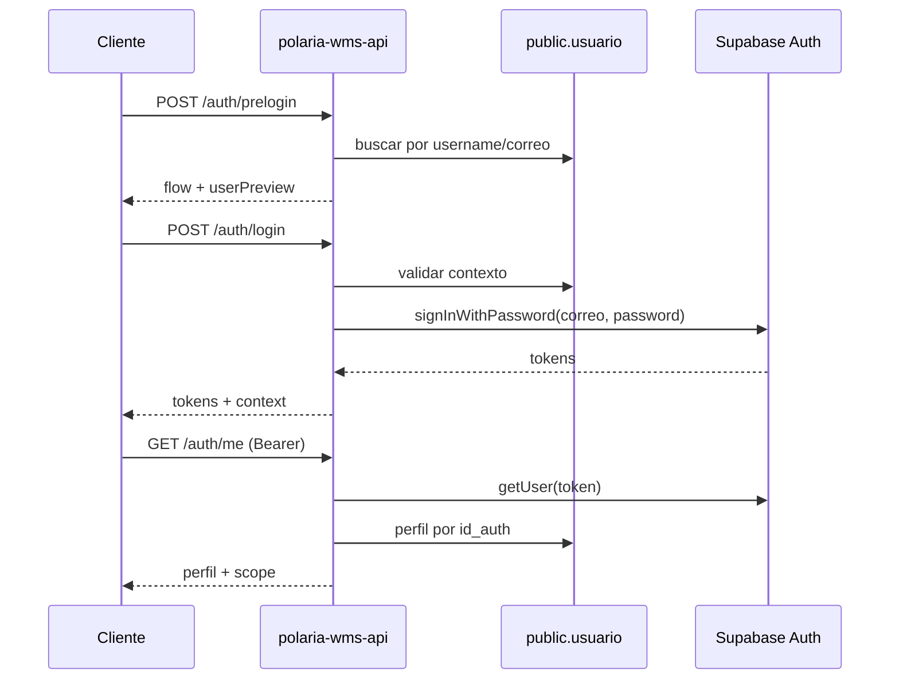

# Contrato de endpoints — módulo Auth

Base path: `/auth`

Autorización basada en `public.usuario` (rol, empresa, cuenta). Las contraseñas solo existen en `auth.users` de Supabase.

---

## POST /auth/prelogin

Valida identidad y contexto antes de solicitar contraseña.

### Request

```json
{
  "identificador": "username o correo",
  "codigoEmpresa": "EMP001"
}
```

| Campo | Tipo | Requerido | Notas |
|---|---|---|---|
| `identificador` | string | sí | `username` o `correo` (citext) |
| `codigoEmpresa` | string | condicional | Obligatorio para roles distintos de `configurador` |

### Response 200

```json
{
  "ok": true,
  "requiresPassword": true,
  "flow": "platform",
  "userPreview": {
    "idUsuario": "uuid",
    "nombre": "Nombre Apellido",
    "username": "usuario",
    "idRol": "configurador",
    "nombreRol": "Configurador (TI)",
    "codigoEmpresa": null,
    "codigoCuenta": null
  }
}
```

| Campo | Valores |
|---|---|
| `flow` | `platform` (configurador) \| `tenant` (resto de roles) |
| `userPreview` | Sin correo ni datos sensibles |

### Errores

| HTTP | Condición |
|---|---|
| 400 | Body inválido (validación DTO) |
| 404 | Usuario no encontrado o inactivo |
| 422 | Tenant sin `codigoEmpresa` |
| 403 | Empresa no coincide, empresa/cuenta inactiva |

---

## POST /auth/login

Autentica con Supabase Auth tras repetir validaciones de prelogin.

### Request

```json
{
  "identificador": "username o correo",
  "codigoEmpresa": "EMP001",
  "password": "plain-text"
}
```

| Campo | Tipo | Requerido | Notas |
|---|---|---|---|
| `identificador` | string | sí | |
| `codigoEmpresa` | string | condicional | Omitir/null para configurador |
| `password` | string | sí | Nunca se persiste en la API |

### Response 200

```json
{
  "accessToken": "eyJ...",
  "refreshToken": "v1...",
  "expiresIn": 3600,
  "tokenType": "bearer",
  "context": {
    "idUsuario": "uuid",
    "idRol": "administrador_cuenta",
    "codigoEmpresa": "EMP001",
    "codigoCuenta": null,
    "scope": "tenant"
  }
}
```

| Campo | Valores |
|---|---|
| `context.scope` | `platform` \| `tenant` |
| `context.codigoEmpresa` | `null` para configurador |

### Errores

| HTTP | Condición |
|---|---|
| 400 | Body inválido |
| 401 | Credenciales Supabase inválidas |
| 404 | Usuario no encontrado |
| 422 | Tenant sin `codigoEmpresa` |
| 403 | Empresa no coincide o inactiva |

---

## GET /auth/me

Retorna perfil y contexto de sesión del usuario autenticado.

### Headers

```
Authorization: Bearer <accessToken>
```

### Response 200

```json
{
  "idUsuario": "uuid",
  "idAuth": "uuid",
  "nombre": "Nombre",
  "username": "usuario",
  "correo": "user@empresa.com",
  "idRol": "administrador_cuenta",
  "nombreRol": "Administrador de cuenta",
  "nivelRol": "cuenta",
  "codigoEmpresa": "EMP001",
  "razonSocialEmpresa": "Empresa Demo SA",
  "codigoCuenta": null,
  "nombreComercialCuenta": null,
  "scope": "tenant"
}
```

Para **configurador**: `codigoEmpresa`, `codigoCuenta`, `razonSocialEmpresa` y `nombreComercialCuenta` son `null`; `scope` = `platform`.

### Errores

| HTTP | Condición |
|---|---|
| 401 | Token ausente, inválido o expirado |
| 404 | Usuario inactivo o no vinculado en `public.usuario` |

---

## POST /auth/logout

Invalida la sesión global del usuario en Supabase Auth.

### Headers

```
Authorization: Bearer <accessToken>
```

### Response

`204 No Content` (sin body)

### Errores

| HTTP | Condición |
|---|---|
| 401 | Token inválido o fallo al cerrar sesión |

---

## Variables de entorno requeridas

| Variable | Uso |
|---|---|
| `SUPABASE_URL` | Cliente Auth |
| `SUPABASE_ANON_KEY` | `signInWithPassword`, validación JWT |
| `SUPABASE_SERVICE_ROLE_KEY` | `admin.signOut` global |
| `DATABASE_URL` | Prisma (lookups backend, bypass RLS) |

---

## Flujos


